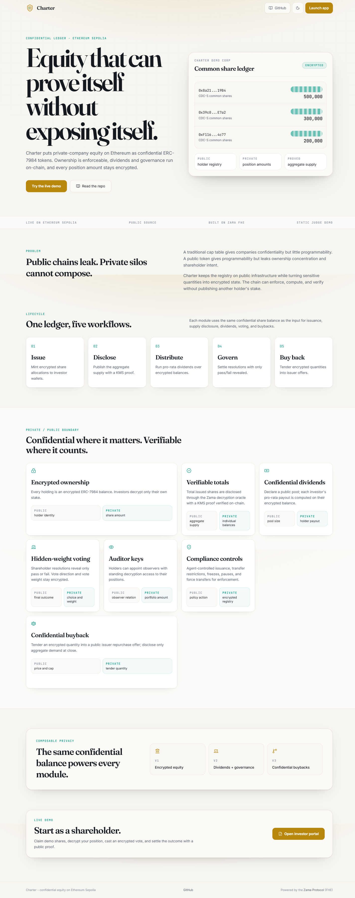
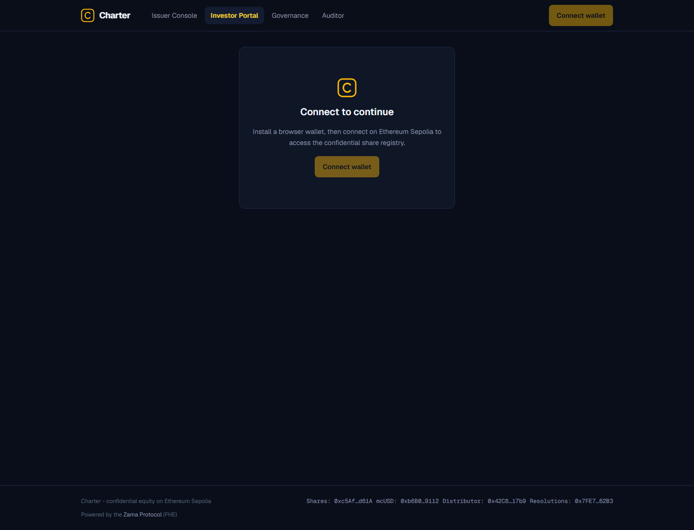
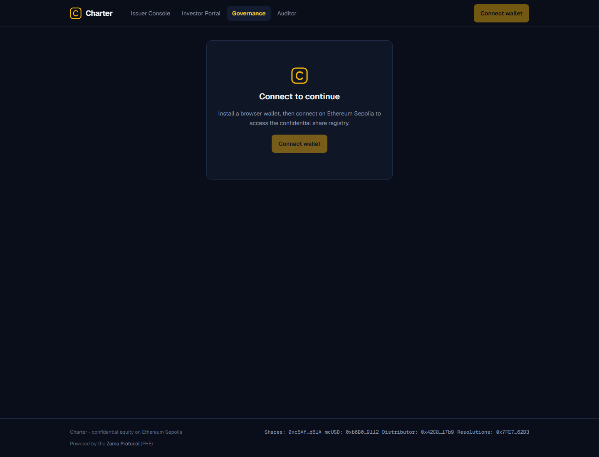

# Charter

Charter is a confidential equity cap table with dividends and shareholder governance on Ethereum Sepolia. Shares are
ERC-7984 confidential tokens: issuers can mint encrypted allocations, disclose proof-backed aggregate supply, distribute
confidential payouts, run hidden-weight resolutions, and grant auditor view access without publishing balances, payouts,
or voting weight.

App URL: `https://charter.gudman.xyz`.

## Screenshots







## Why Charter exists

Public-chain cap tables leak the holdings, transfers, voting weight, and payout history of every investor. Traditional
private-company cap tables preserve privacy by becoming opaque off-chain silos, where enforcement, payouts, and audits
depend on coordination outside the chain. Private equity needs enforceable infrastructure with selective disclosure:
public totals and proof-backed outcomes, private investor-level economics. Charter makes the registry programmable while
keeping quantities encrypted.

## Architecture

```text
Issuer / Investor / Auditor / Governance UI
        |
        | user decryption: EIP-712 session -> relayer/KMS -> cleartext in browser
        | public disclosure: publicDecrypt -> KMS proof -> FHE.checkSignatures on-chain
        v
+--------------------+        module ACL        +-----------------------+
| CharterShares      | <----------------------> | DividendDistributor   |
| ERC7984Rwa         |                           | encrypted pro-rata    |
| ERC7984Votes       |                           | mcUSD payouts         |
| ObserverAccess     |                           +-----------------------+
+---------+----------+
          | module ACL / agent grant
          v
+--------------------+                           +-----------------------+
| CharterResolutions |                           | MockConfidentialUSD   |
| encrypted votes    | <-----------------------> | testnet ERC-7984 cash |
| outcome proof      |        payouts            | token                 |
+--------------------+                           +-----------------------+
          ^
          |
+--------------------+
| DemoShareFaucet    |
| one-time grants    |
+--------------------+
```

The frontend loads the relayer SDK only through `web/lib/fhevm.ts`. User decryptions use an EIP-712 session cached in
`sessionStorage` for one day. Public disclosures use relayer/KMS output that the contracts verify with
`FHE.checkSignatures`.

## Flows

| Flow              | Contract path                                                                                      | What stays private                  | What becomes public                                                   |
| ----------------- | -------------------------------------------------------------------------------------------------- | ----------------------------------- | --------------------------------------------------------------------- |
| Issuance          | `CharterShares.confidentialMint(address,bytes32,bytes)`                                            | Each minted allocation              | Holder address and encrypted handle                                   |
| Supply disclosure | `requestSupplyDisclosure()` -> relayer `publicDecrypt` -> `finalizeSupplyDisclosure(uint64,bytes)` | Individual balances                 | Total issued shares, record block, and KMS proof verification         |
| Distributions     | `pause()` -> `DividendDistributor.declare()` -> `payBatch()`                                       | Each investor balance and payout    | Pool amount, distribution id, batch investor addresses, and paid flag |
| Resolutions       | self-delegate -> `propose()` -> encrypted `castVote()` -> `requestTally()` -> `settle(bool,bytes)` | Vote direction and weight per voter | Pass/fail outcome and which addresses voted                           |
| Observer access   | `setObserver(account, observer)` -> `/auditor` decrypts `confidentialBalanceOf(account)`           | Everyone else still sees ciphertext | Holder-chosen observer can decrypt that holder's share balance        |
| Self-serve demo   | `DemoShareFaucet.claim()` and `MockConfidentialUSD.faucet()`                                       | Claimed balances                    | Claim transaction and recipient address                               |

Distribution math is computed over ciphertext: `encBalance * pool / totalSharesOnRecord`. The divisor is scalar and
public; individual balances and payout handles remain encrypted. Resolution voting uses an encrypted `ebool` and
checkpointed `getPastVotes` weight, then discloses only the encrypted comparison result: pass or fail.

## Design Decisions And Constraints

- Only the pass/fail outcome of a resolution is disclosed. Individual vote weights and directions never leave
  ciphertext. Voter participation is public.
- Cap-table membership and participation are public; only quantities are encrypted.
- Dividend record date is the pause that must be in place at `declare`. The contract enforces pause-before-declare.
- Re-run supply disclosure after any issuance before declaring a distribution. `supplyDisclosureStale()` enforces this.
- User-decryption plaintext is reconstructed in the browser. The relayer sees only ciphertext, but the Zama threshold
  KMS committee performs the underlying decryption as part of the protocol. The issuer/agent inherently can decrypt
  allocations it mints.
- Observer removal is prospective only. Values already shared remain decryptable by the former observer.
- `mcUSD` is an open-mint testnet mock with no value.
- HCU budget drives batching. `payBatch` is designed for roughly 15 investors per transaction; this size is a
  conservative estimate and is not yet benchmarked at that batch size.
- `pool * totalShares <= 2^64` is enforced before distribution declaration so encrypted `euint64` payout math cannot
  overflow. With a fresh, non-stale supply disclosure, no holder balance can exceed the denominator.
- Shares are whole units with `decimals() == 0`, matching private-company share ledgers.
- Total shares are deliberately public after disclosure. Real cap tables can expose the count while keeping holder-level
  ownership and payouts private.
- `sweep` is issuer-trusted and can return remaining confidential payment-token balance to a chosen address.
- `CharterShares.isModule` is a trusted-module registry: a registered module can request ACL access to handles the token
  contract holds; the shipped modules request only transient, per-transaction access to the balances and checkpoints
  they compute on. Module registration is admin-only and is the trust boundary.

## Security Posture

Charter builds on `@openzeppelin/confidential-contracts` v0.5.1 and `@fhevm/solidity` v0.11.1. Inherited surfaces
include `ERC7984Rwa` for admin/agent controls, restrictions, freezes, force transfers, and pause; `ERC7984Votes` for
checkpointed encrypted voting power; and `ERC7984ObserverAccess` for holder-appointed observers.

The custom code adds the supply disclosure flow, trusted module registry, pro-rata distributor, outcome-only resolution
module, one-time demo share faucet, and testnet mcUSD token. The local FHEVM mock test suite currently covers issuance,
disclosure, distributions, stale-supply rejection, outcome-only resolutions, observer access, compliance controls, and
demo faucet claims.

## Getting Started

```bash
git clone https://github.com/Ridwannurudeen/charter
cd charter
npm i
npx hardhat test
cd web && npm i && npm run dev
```

### Scenario Tasks

| Task                                                                                                 | Purpose                                           |
| ---------------------------------------------------------------------------------------------------- | ------------------------------------------------- |
| `npx hardhat scenario:issue --network sepolia --to 0x... --amount 500000`                            | Mint encrypted shares to an investor              |
| `npx hardhat scenario:claim-shares --network sepolia --signer 3`                                     | Claim one-time demo shares for a signer           |
| `npx hardhat scenario:disclose --network sepolia`                                                    | Publicly disclose total supply with proof         |
| `npx hardhat scenario:fund --network sepolia --amount 10000`                                         | Mint mcUSD to deployer and approve distributor    |
| `npx hardhat scenario:declare --network sepolia --pool 10000`                                        | Pause if needed, then declare a distribution pool |
| `npx hardhat scenario:pay --network sepolia --id 0 --investors 0x...,0x...`                          | Pay a paused distribution batch, then unpause     |
| `npx hardhat scenario:delegate --network sepolia --signer 1`                                         | Self-delegate voting power for a signer           |
| `npx hardhat scenario:propose --network sepolia --text "Approve the Series A financing" --blocks 40` | Create a resolution                               |
| `npx hardhat scenario:vote --network sepolia --id 0 --support true --signer 1`                       | Cast an encrypted vote                            |
| `npx hardhat scenario:request-tally --network sepolia --id 0`                                        | Request a pass/fail outcome without settling      |
| `npx hardhat scenario:settle --network sepolia --id 0`                                               | Publicly decrypt the pass/fail outcome and settle |
| `npx hardhat scenario:status --network sepolia`                                                      | Print read-only lifecycle state                   |

## Deployed Contracts

Round-two contracts were redeployed on Sepolia on 2026-07-03 and source-verified on both Etherscan and Sourcify (partial
match).

| Contract              | Address                                      | Etherscan                                                                                        | Sourcify                                                                                                                |
| --------------------- | -------------------------------------------- | ------------------------------------------------------------------------------------------------ | ----------------------------------------------------------------------------------------------------------------------- |
| `CharterShares`       | `0xc5Af9E2b3A110D20D914c5771beb5DFBA5F6d61A` | [verified](https://sepolia.etherscan.io/address/0xc5Af9E2b3A110D20D914c5771beb5DFBA5F6d61A#code) | [partial match](https://repo.sourcify.dev/contracts/partial_match/11155111/0xc5Af9E2b3A110D20D914c5771beb5DFBA5F6d61A/) |
| `MockConfidentialUSD` | `0xb6B08dC3014D944231E01Ad5a0292Efeea859112` | [verified](https://sepolia.etherscan.io/address/0xb6B08dC3014D944231E01Ad5a0292Efeea859112#code) | [partial match](https://repo.sourcify.dev/contracts/partial_match/11155111/0xb6B08dC3014D944231E01Ad5a0292Efeea859112/) |
| `DividendDistributor` | `0x42C8c19fbC1E2F5649d540237759E7bFee5617b9` | [verified](https://sepolia.etherscan.io/address/0x42C8c19fbC1E2F5649d540237759E7bFee5617b9#code) | [partial match](https://repo.sourcify.dev/contracts/partial_match/11155111/0x42C8c19fbC1E2F5649d540237759E7bFee5617b9/) |
| `CharterResolutions`  | `0x7FE785A2ec9cFb10283fAB7aE6d2c2d3Ad5662B3` | [verified](https://sepolia.etherscan.io/address/0x7FE785A2ec9cFb10283fAB7aE6d2c2d3Ad5662B3#code) | [partial match](https://repo.sourcify.dev/contracts/partial_match/11155111/0x7FE785A2ec9cFb10283fAB7aE6d2c2d3Ad5662B3/) |
| `DemoShareFaucet`     | `0x9AF5A8e7d036E4347D0458748D9bC27131D0710C` | [verified](https://sepolia.etherscan.io/address/0x9AF5A8e7d036E4347D0458748D9bC27131D0710C#code) | [partial match](https://repo.sourcify.dev/contracts/partial_match/11155111/0x9AF5A8e7d036E4347D0458748D9bC27131D0710C/) |

## Composes With

Charter is a reusable ERC-7984 equity-registry primitive. The share token is a standard confidential token that can sit
beside the Confidential Wrapper Registry and other ERC-7984 token rails. The module registry lets new distribution,
governance, compliance, or reporting modules plug into the share token without changing the registry itself, with module
registration acting as the explicit trust boundary.

Charter is not a token cap-table dashboard. It is the privacy-preserving equity registry layer beneath dividends,
shareholder governance, and auditor access.

## Program

Built for the [Zama Developer Program Season 3](https://www.zama.org/programs/developer-program), Builder Track.
